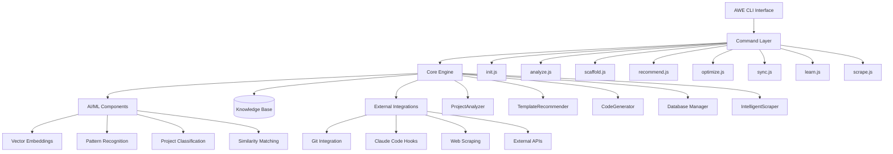
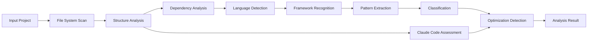
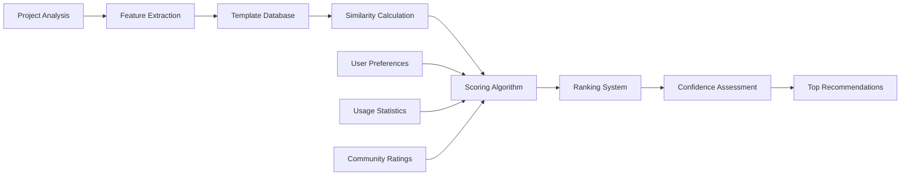
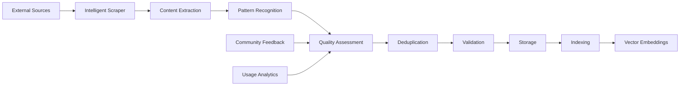
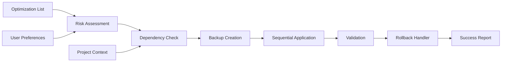
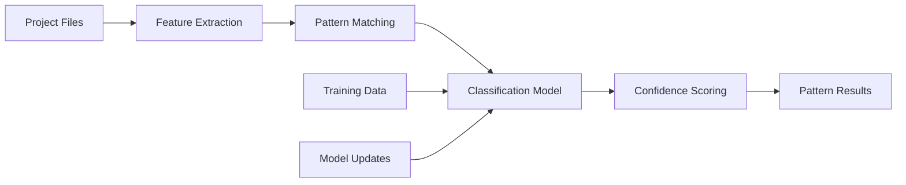
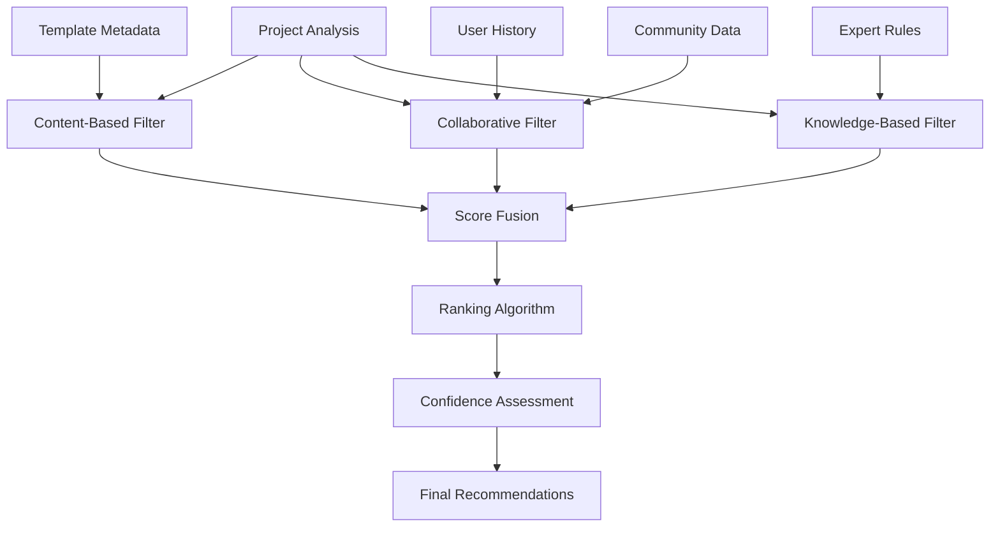
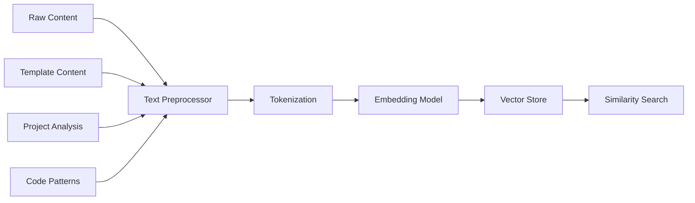
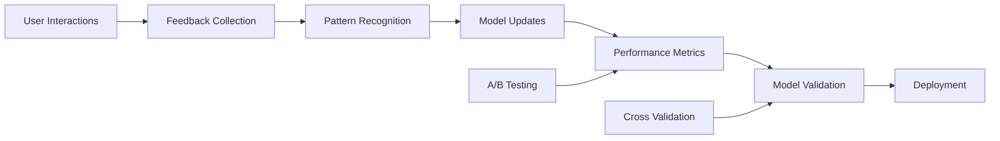

# AWE CLI Tool Architecture

## Overview
The AWE CLI tool is an intelligent companion for Claude Code that provides project analysis, template recommendations, and automated setup capabilities. It combines AI-powered analysis with a comprehensive knowledge base to deliver context-aware optimizations and development workflow improvements.

## Architecture Design

### System Architecture Diagram



### Core Components

```
awe-cli/
├── bin/
│   └── awe.js             # CLI entry point with error handling
├── src/
│   ├── commands/          # CLI command implementations
│   │   ├── init.js        # Project initialization with templates
│   │   ├── analyze.js     # Comprehensive project analysis
│   │   ├── scaffold.js    # Project scaffolding and generation
│   │   ├── recommend.js   # AI-powered recommendations
│   │   ├── optimize.js    # Automated optimization application
│   │   ├── sync.js        # Knowledge base synchronization
│   │   ├── learn.js       # Learning system management
│   │   └── scrape.js      # Intelligent pattern scraping
│   ├── core/              # Core functionality modules
│   │   ├── analyzer.js    # Project analysis engine
│   │   ├── recommender.js # Template recommendation system
│   │   ├── generator.js   # Code/config generation
│   │   ├── database.js    # SQLite knowledge base
│   │   └── scraper.js     # Intelligent web scraping
│   ├── utils/             # Shared utilities
│   │   ├── logger.js      # Winston-based logging
│   │   ├── validation.js  # Input validation
│   │   └── updater.js     # Auto-update functionality
│   └── index.js           # Main module for programmatic use
├── docs/                  # Comprehensive documentation
│   ├── CLI_REFERENCE.md   # Complete CLI command reference
│   ├── USER_GUIDE.md      # User workflows and examples
│   ├── API_REFERENCE.md   # Programmatic API documentation
│   ├── architecture.md    # This architecture document
│   └── TROUBLESHOOTING.md # Problem-solving guide
├── templates/             # Built-in project templates
├── database/              # Database schemas and migrations
└── tests/                 # Comprehensive test suite
```

## Command Structure

### Primary Commands

#### `awe init`
Interactive project initialization
- Analyzes existing project structure
- Suggests optimal CLAUDE.md template
- Creates project requirements document
- Sets up basic configuration

#### `awe analyze`
Project analysis and optimization
- Scans codebase for patterns
- Identifies optimization opportunities
- Suggests performance improvements
- Generates analysis report

#### `awe scaffold [pattern]`
Project scaffolding and generation
- Creates project skeleton based on patterns
- Generates boilerplate code
- Sets up development environment
- Configures tooling

#### `awe recommend`
AI-powered recommendations
- Context-aware suggestions
- Best practice recommendations
- Template suggestions
- Optimization advice

#### `awe sync`
Knowledge base synchronization
- Updates local knowledge base
- Pulls latest templates and patterns
- Syncs community contributions
- Updates AI models

### Advanced Commands

#### `awe learn`
Learning and adaptation
- Learns from user interactions
- Improves recommendations
- Updates success metrics
- Adapts to user preferences

#### `awe optimize`
Automated optimization
- Applies performance optimizations
- Updates configurations
- Fixes common issues
- Implements best practices

## Data Flow Architecture

### 1. Project Analysis Pipeline



**Analysis Components:**
- **File System Scanner**: Recursive directory traversal with gitignore support
- **Structure Analyzer**: File organization, depth, and complexity metrics
- **Dependency Analyzer**: Package.json, requirements.txt, and lock file parsing
- **Language Detector**: File extension and content-based language identification
- **Framework Recognizer**: Pattern matching for popular frameworks and libraries
- **Pattern Extractor**: Architecture pattern and naming convention detection
- **Project Classifier**: ML-based project type classification
- **Claude Code Assessor**: CLAUDE.md and .claude directory evaluation

### 2. Template Recommendation Flow



**Recommendation Components:**
- **Feature Extractor**: Converts analysis into numerical features
- **Similarity Calculator**: Cosine similarity and Euclidean distance
- **Scoring Algorithm**: Multi-factor scoring (category, language, framework, patterns)
- **Ranking System**: Priority-based recommendation ordering
- **Confidence Assessor**: Statistical confidence calculation
- **Personalization Engine**: User preference and history integration

### 3. Knowledge Base Update Flow



**Scraping Components:**
- **Multi-Source Scraper**: GitHub, documentation sites, forums
- **Content Extractor**: HTML parsing and content cleaning
- **Pattern Recognizer**: Code pattern and template identification
- **Quality Assessor**: Relevance and quality scoring
- **Deduplication Engine**: Content similarity detection
- **Validator**: Schema and format validation
- **Vector Generator**: Embeddings for semantic search

### 4. Optimization Application Flow



## AI and Machine Learning Components

### Pattern Recognition Engine

**Architecture:**


**Components:**
- **Feature Extractor**: Converts code structure into numerical features
  - File organization patterns
  - Naming convention analysis
  - Directory structure fingerprints
  - Dependency relationship graphs
- **Pattern Matcher**: Rule-based and ML hybrid pattern detection
  - MVC/MVP/MVVM architecture patterns
  - Microservices vs monolithic detection
  - Test-driven development indicators
  - CI/CD pipeline presence
- **Classification Model**: Multi-class project type classifier
  - Input: 200+ dimensional feature vectors
  - Algorithm: Gradient boosting with ensemble methods
  - Output: Project type with confidence scores
  - Types: web-app, api-service, library, cli-tool, data-science, mobile-app

### Recommendation System

**Hybrid Architecture:**


**Filtering Strategies:**
- **Content-Based Filtering**:
  - Template feature matching (language, framework, patterns)
  - Cosine similarity on template vectors
  - Technology stack compatibility scoring
- **Collaborative Filtering**:
  - User-item matrix factorization
  - Similar user preference learning
  - Community usage pattern analysis
- **Knowledge-Based Filtering**:
  - Expert-defined rules and constraints
  - Business logic and best practices
  - Contextual recommendation adjustments

### Vector Embedding System

**Embedding Architecture:**


**Embedding Components:**
- **Text Preprocessor**: 
  - Code comment extraction
  - Documentation parsing
  - Configuration file analysis
- **Embedding Model**: 
  - Sentence-BERT for semantic understanding
  - Code2Vec for code structure embeddings
  - Custom domain-specific embeddings
- **Vector Storage**: 
  - High-dimensional vector indexing
  - FAISS for efficient similarity search
  - Incremental updates and versioning

### Learning and Adaptation System

**Continuous Learning Architecture:**


**Learning Components:**
- **Feedback Collector**: Implicit and explicit user feedback
- **Pattern Recognizer**: Success/failure pattern identification
- **Model Updater**: Online learning and incremental training
- **Performance Monitor**: Recommendation accuracy tracking
- **Validation System**: Cross-validation and holdout testing

## Database Schema

### Templates Table
```sql
CREATE TABLE templates (
    id INTEGER PRIMARY KEY,
    name TEXT NOT NULL,
    category TEXT,
    description TEXT,
    content TEXT,
    metadata JSON,
    usage_count INTEGER DEFAULT 0,
    rating REAL DEFAULT 0,
    created_at TIMESTAMP,
    updated_at TIMESTAMP
);
```

### Projects Table
```sql
CREATE TABLE projects (
    id INTEGER PRIMARY KEY,
    path TEXT UNIQUE,
    type TEXT,
    language TEXT,
    framework TEXT,
    features JSON,
    template_id INTEGER,
    performance_metrics JSON,
    created_at TIMESTAMP,
    FOREIGN KEY (template_id) REFERENCES templates(id)
);
```

### Patterns Table
```sql
CREATE TABLE patterns (
    id INTEGER PRIMARY KEY,
    name TEXT NOT NULL,
    description TEXT,
    code_pattern TEXT,
    category TEXT,
    effectiveness_score REAL,
    usage_examples JSON,
    created_at TIMESTAMP
);
```

### Embeddings Table
```sql
CREATE TABLE embeddings (
    id INTEGER PRIMARY KEY,
    entity_type TEXT, -- 'template', 'project', 'pattern'
    entity_id INTEGER,
    embedding BLOB, -- Vector embedding
    model_version TEXT,
    created_at TIMESTAMP
);
```

## Integration Points

### Claude Code Hooks
```json
{
  "pre_session": "awe analyze --silent --suggest-optimizations",
  "post_tool_use": "awe learn --from-interaction",
  "pre_feature": "awe recommend --for-feature --context"
}
```

### Git Integration
- Auto-detect project changes
- Track optimization improvements
- Version control for configurations

### External APIs
- GitHub API for template discovery
- Package registries for dependency analysis
- Documentation sites for best practices

## Performance Considerations

### Caching Strategy
- Template cache with TTL
- Project analysis cache
- Embedding cache for similarity searches

### Optimization Techniques
- Lazy loading of AI models
- Incremental analysis updates
- Background knowledge base updates

### Scalability Design
- Modular architecture for easy extension
- Plugin system for custom analyzers
- Distributed knowledge base support

## Security Considerations

### Data Privacy
- Local-first approach for sensitive data
- Anonymized telemetry
- User consent for data sharing

### Code Security
- Sandboxed template execution
- Input validation and sanitization
- Secure credential handling

## Development Workflow

### Testing Strategy
- Unit tests for core components
- Integration tests for CLI commands
- End-to-end tests for user workflows

### Deployment Strategy
- NPM package distribution
- Auto-updates for knowledge base
- Backward compatibility maintenance

## Future Enhancements

### Advanced AI Features
- Multi-modal understanding (code + docs + configs)
- Predictive optimization
- Automated refactoring suggestions

### Community Features
- Template marketplace
- Community ratings and reviews
- Collaborative filtering improvements

### Enterprise Features
- Team analytics and insights
- Custom template repositories
- Integration with enterprise tools