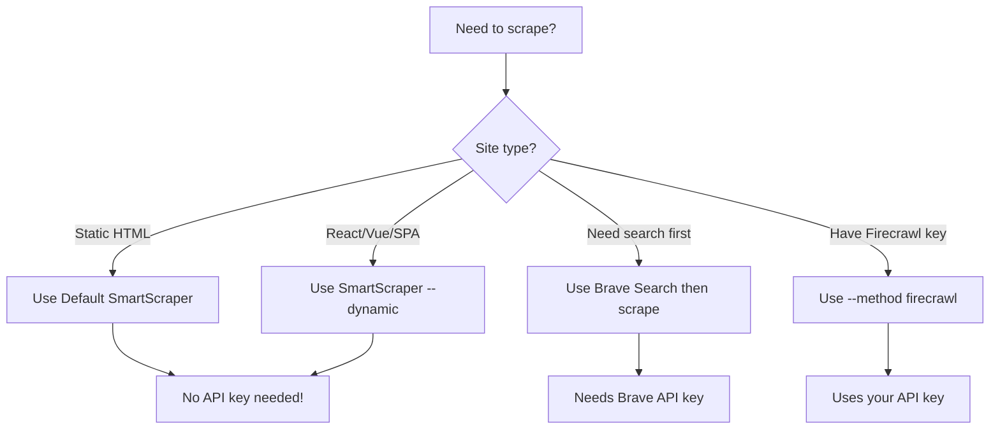

# AWE Web Scraping Quick Start Guide

## 🚀 TL;DR - Just Use SmartScraper!

```bash
# Scrape any website - no API keys needed!
awe learn --url https://any-website.com

# That's it! AWE automatically:
# ✅ Detects if site needs JavaScript
# ✅ Scrapes the content
# ✅ Converts to markdown
# ✅ Extracts patterns
# ✅ Stores in database
```

## 📊 What Scraper Does AWE Use?

AWE automatically selects the best scraper based on what's available:

```
Priority Order:
1. SmartScraper (default) - No API key needed! ✨
2. Firecrawl (if API key set) - Managed cloud service
3. Legacy scraper (fallback) - Basic HTML only
```

## 🎯 Common Use Cases

### Scrape a Single Page
```bash
# Default - uses SmartScraper
awe learn --url https://docs.example.com/page

# Force a specific method
awe learn --url https://site.com --method smart     # Playwright-based
awe learn --url https://site.com --method firecrawl  # Cloud service
awe learn --url https://site.com --method legacy     # Basic HTML
```

### Crawl Multiple Pages
```bash
# Crawl up to 10 pages, 2 levels deep
awe learn --url https://docs.site.com --pages 10 --depth 2

# Crawl more aggressively
awe learn --url https://docs.site.com --pages 50 --depth 3
```

### Force JavaScript Rendering
```bash
# For React/Vue/Angular apps that need JS
awe learn --url https://react-app.com --dynamic
```

## 🔧 Configuration Options

### Use Firecrawl (Optional)
```bash
# Cloud API (rate limited but managed)
export FIRECRAWL_API_KEY="your-api-key"

# Self-hosted (unlimited, requires Docker)
export FIRECRAWL_API_URL="http://localhost:3002"
```

### Use SmartScraper (Default)
```bash
# No configuration needed!
# Just works out of the box
```

## 📈 Performance Comparison

| Site Type | Best Method | Speed | Why |
|-----------|------------|-------|-----|
| Static docs (MDN, Wikipedia) | SmartScraper | ~500ms | Uses fast Cheerio parser |
| React/Vue apps | SmartScraper | ~3s | Auto-switches to Playwright |
| Simple HTML | Legacy | ~200ms | Minimal overhead |
| Complex SPAs | Firecrawl/Smart | ~2-5s | Full JS execution |

## 🎨 What Gets Extracted?

Every scrape automatically extracts:

1. **Content**
   - Title
   - Full text content
   - Markdown-formatted version

2. **Structure**
   - All links on the page
   - Images (optional)
   - Code blocks

3. **Patterns** (AI-detected)
   - Configuration examples
   - Best practices
   - Code snippets
   - Anti-patterns
   - Documentation structure

4. **Metadata**
   - Scrape timestamp
   - Method used (static/dynamic)
   - Load time
   - Status codes

## 🚫 No API Keys Required!

Unlike other solutions, AWE's SmartScraper needs **ZERO** configuration:

| Solution | Requires API Key | Rate Limits |
|----------|-----------------|-------------|
| **SmartScraper** | ❌ No | None |
| Firecrawl | ✅ Yes | 500/month free |
| ScrapingBee | ✅ Yes | 1000/month free |
| Apify | ✅ Yes | Varies |
| Bright Data | ✅ Yes | Paid only |

## 📝 Example Output

```bash
$ awe learn --url https://react.dev/learn

🧠 AWE Knowledge Gathering

🎭 Scraping https://react.dev/learn...
✔ Smart scraping complete!

📊 Scraping Results:

URL: https://react.dev/learn
├─ Title: Quick Start – React
├─ Content: 1,247 words
├─ Links found: 42
├─ Images found: 8
├─ Method: dynamic (auto-detected React site)
└─ Load time: 2,341ms

📝 Content Preview:
# Quick Start

Welcome to the React documentation! This page will give you an introduction 
to the 80% of React concepts that you will use on a daily basis...

🎯 Patterns Found:
├─ Code examples: 12
├─ Best practices: 5
├─ Configuration: 3
└─ Documentation: 8
```

## 🔍 Troubleshooting

### "Playwright not installed"
```bash
# Install Playwright browsers
cd packages/ai
npx playwright install chromium
```

### "Rate limit exceeded" (Firecrawl)
```bash
# Switch to SmartScraper (no limits!)
unset FIRECRAWL_API_KEY
awe learn --url https://site.com
```

### "JavaScript not executing"
```bash
# Force dynamic scraping
awe learn --url https://spa-site.com --dynamic
```

## 🚀 Advanced Usage

### Crawl and Extract Patterns
```bash
# Crawl documentation site and extract all patterns
awe learn --url https://docs.anthropic.com \
  --pages 20 \
  --depth 3 \
  --method smart

# View extracted patterns in database
awe patterns list
```

### Batch Scraping
```bash
# Create a list of URLs
cat > urls.txt << EOF
https://site1.com
https://site2.com
https://site3.com
EOF

# Scrape all (coming soon)
awe learn --file urls.txt
```

## 💡 Pro Tips

1. **Start Small**: Test with 1-2 pages before crawling entire sites
2. **Check Robots.txt**: Be respectful of site policies
3. **Use Caching**: SmartScraper caches for 5 minutes by default
4. **Monitor Resources**: Playwright uses ~200MB RAM per instance
5. **Be Polite**: Default delay is 1 second between requests

## 🎯 Which Method Should I Use?



## 🎉 That's It!

You're ready to scrape any website with AWE. No API keys, no rate limits, just pure scraping power!

```bash
# Start scraping now!
awe learn --url https://your-favorite-docs.com
```